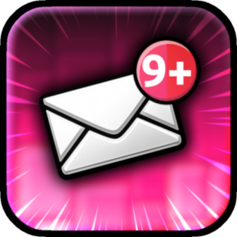
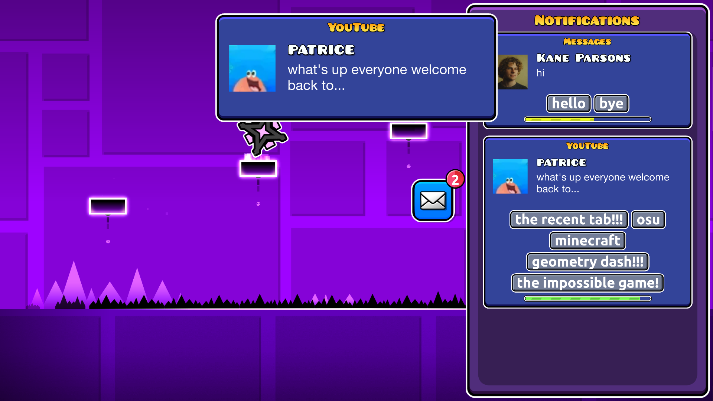
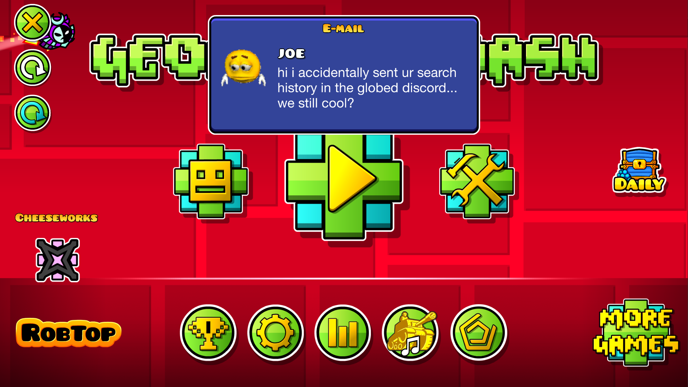

#  Annoying Notifications...
Check your notification feed or lose!

>   

>  
>  
> 

> [!TIP]
> *This mod has settings you can utilize to customize your experience.*

---

## About
A totally awesome mod that spams notifications while playing levels.

---

### Check Up On Them!
Hilarious notifications will be mercilessly filling your inbox and take up its space. If it gets too full, you will get kicked out of the level, so be sure you check on enough notifications in time to save yourself!

To get rid of notifications, press the correct button to reply! Depends on what the notification is about.

#### What the heck do I do?!
Sometimes, to find the right response to continue playing, you'll have to use some twisted logic, find the odd one out, or just press one and pray it won't restart you... Screw it, why not just ALL of that?

#### I don't want this!
Ah, alrighty... You can disable *Challenge Mode* in this mod's settings if you only wish to have notifications show up without consequences!

### Live Toggling
You can disable the chaotic notifications during gameplay if you have [Horrible Menu](https://geode-sdk.org/mods/cubicstudios.horriblemenu) installed! Find Annoying Notifications's options in their menu.

---

---

### Changelog
###### What's new?!
**[📜 View the latest updates and patches](./changelog.md)**

### Issues
###### What's wrong?!
**[⚠️ Report a problem with the mod](../../issues/)**